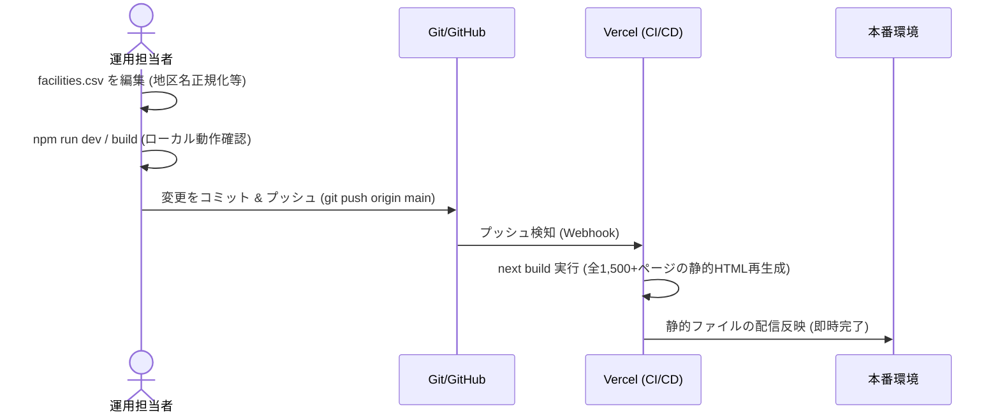

# システム構成とアーキテクチャ (Architecture)

本システム（オール介護ポータル）の全体構成、データの流れ、更新フロー、および主要ファイルの役割について説明します。

---

## 1. システム構成

本システムは **Next.js (App Router, v16.x)** をベースにしたWebアプリケーションです。
ホスティング環境や運用の負荷・コストを最小限に抑えるため、サーバーサイドのデータベース（RDB等）を持たず、**CSVファイルをデータベースの代替として用いる静的ジェネレーション（SSG）主体の設計**となっています。

---

## 2. データの流れ (Data Flow)

データの参照および描画の流れは以下の通りです。

```mermaid
graph TD
    CSV[(data/facilities.csv)] -->|fs.readFileSync| LIB[lib/facilities.ts]
    LIB -->|getFacilities| APP_TOP[app/page.tsx <br> トップページ]
    LIB -->|getFacilities| APP_LIST[app/facilities/page.tsx <br> 一覧検索ページ]
    LIB -->|getFacilities| APP_DETAIL[app/facilities/[slug]/page.tsx <br> 詳細ページ]
    
    APP_TOP -->|都市を選択| APP_LIST
    APP_LIST -->|詳細リンクをクリック| APP_DETAIL
```

1. **データソース (`data/facilities.csv`)**
   すべての事業所データ（公開フラグ、事業所番号、名称、エリア、住所、電話番号など）がこのCSVファイルに一元管理されています。
2. **データロード層 (`lib/facilities.ts`)**
   `getFacilities()` 関数がCSVファイルを読み込み、JavaScriptオブジェクトの配列（`Facility[]`）にパースして各ページコンポーネントに提供します。
3. **トップページ (`app/page.tsx`)**
   ロードされたデータから市区町村（`city`）の一覧を動的に抽出し、「エリアから探す」のボタン群として表示します。
4. **一覧ページ (`app/facilities/page.tsx`)**
   クエリパラメータ（`city`, `area`, `type`, `keyword`）を受け取り、動的にフィルターを適用した事業所リストをレンダリングします。
5. **詳細ページ (`app/facilities/[slug]/page.tsx`)**
   ビルド時に `generateStaticParams()` を用いて、CSV上の全公開事業所の `slug` から詳細ページを静的生成（SSG）します。

---

## 3. 更新フロー (Update Flow)

マスタデータの追加・修正・非公開化に伴う、システム全体の更新デプロイフローです。



---

## 4. 主要ファイルと役割

| ファイルパス | 役割・役割詳細 |
| :--- | :--- |
| [data/facilities.csv](file:///c:/Projects/care-portal_v2/data/facilities.csv) | **事業所データベース**。<br>すべての掲載情報のマスタデータ。Excelやスクリプトで直接編集可能。 |
| [lib/facilities.ts](file:///c:/Projects/care-portal_v2/lib/facilities.ts) | **データ取得・パース用ライブラリ**。<br>CSVファイルをパースしてTypeScriptの型 `Facility` の配列として返却するヘルパー。 |
| [app/page.tsx](file:///c:/Projects/care-portal_v2/app/page.tsx) | **トップページ**。<br>新着事業所、サービス種別一覧、市区町村ナビゲーションを表示する。 |
| [app/facilities/page.tsx](file:///c:/Projects/care-portal_v2/app/facilities/page.tsx) | **事業所一覧・検索ページ**。<br>キーワード・種別・市区町村・詳細エリア（地区）での動的な絞り込みフィルターを備える。 |
| [app/facilities/[slug]/page.tsx](file:///c:/Projects/care-portal_v2/app/facilities/[slug]/page.tsx) | **事業所詳細ページ**。<br>個別事業所の基本情報、Googleマップリンク、同一地区の周辺事業所リストを表示。 |
| [ADD_CITY.md](file:///c:/Projects/care-portal_v2/ADD_CITY.md) | **市区町村追加ガイド**。<br>新しい市の事業所データを追加する際の手順書。 |

---

## 5. 関連機能 (Related Features)

本ポータルは以下の2つの主要モジュールで構成されています。

1. **介護事業所検索機能**:
   * CSVデータを元にした、市区町村・エリア・種別での絞り込み検索機能。
   * 詳細情報は [docs/features/facilities-search.md](file:///c:/Projects/care-portal_v2/docs/features/facilities-search.md) を参照してください。
2. **制度・支援情報（ニュース）機能**:
   * 介護事業者向けの補助金や制度加算などの情報を探す機能。
   * 検索ロジックは [app/care-news/page.tsx](file:///c:/Projects/care-portal_v2/app/care-news/page.tsx) 内でクライアントサイドにて制御されており、マスタは [data/care-news-cards.ts](file:///c:/Projects/care-portal_v2/data/care-news-cards.ts) にハードコードされています。
