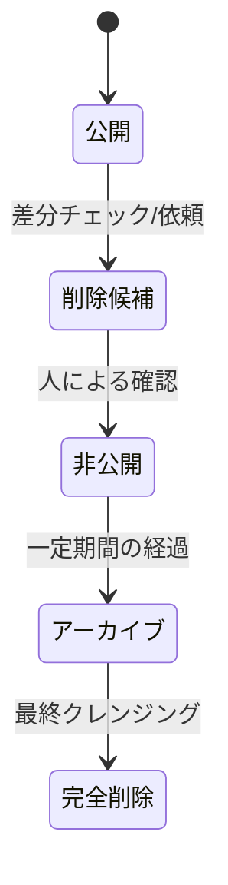

# データ更新ポリシーと運用ガイド (Data Update Policy)

介護事業所データ（[facilities.csv](file:///c:/Projects/care-portal_v2/data/facilities.csv)）の追加・修正・削除プロセス、およびオープンデータ等の元データとの差分を安全にチェックし反映させる運用指針について説明します。

---

## 1. 介護事業所データの分類と更新頻度

マスタデータは以下の3つのトリガーで変動します。

1. **追加 (Addition)**: 新規開業された事業所、または今まで掲載していなかった対象自治体の事業所。
2. **修正 (Modification)**: 名称変更、移転による住所変更、電話番号変更、または運営会社（親法人）の変更など。
3. **削除・非公開化 (Deletion/Unpublish)**: 廃業・休止した事業所、あるいは事業所側から掲載取り下げの依頼があった場合。

自治体が公開するオープンデータ等は一般に **「数ヶ月〜半年に1回」** などの頻度で更新されます。これに合わせて定期的に差分チェックを行います。

---

## 2. 差分チェックの方法（将来的な方針）

手動での全件目視はミスの原因となるため、将来的にはスクリプト（Node.js / Python等）による**自動差分検出（Diff）**を導入します。

* **照合のキー**: 介護サービス事業所ごとに国から割り当てられる一意の **「事業所番号 (officeNumber, 10桁)」** をプライマリキーとして照合します。

### 差分検出の定義

元データ（自治体等の最新CSV）と現データ（`facilities.csv`）を事業所番号で突合した結果：

* **追加候補**: 元データに存在し、現データに存在しない「事業所番号」のレコード。
* **修正候補**: 同一の「事業所番号」で、住所、電話番号、事業所名などの値に不一致があるレコード。
* **削除候補**: 現データに存在するが、元データから消えている「事業所番号」のレコード。

---

## 3. 段階的なデータ削除プロセス（自動削除の禁止）

本ポータル運用の安全性を担保するため、**「元データから消えたレコードを、システムが自動的にCSVから即座に削除・非公開化しない」** という方針を徹底します。

削除が必要なデータは、必ず以下の **5つのステージ** を経て段階的に処理してください。

### ステージ 1: 公開 (Published)
* **状態**: CSVの `isPublished` 列の値が `true`。
* **挙動**: サイト上に表示され、検索可能であり、詳細ページも生成されています。

### ステージ 2: 削除候補 (Delete Candidate)
* **状態**: 元データから存在が確認できなくなった、または閉鎖申請があったデータ。
* **挙動**: データ自体は「公開」のままですが、管理用リスト等に「削除候補」として記録され、オペレーターがステータス（実在しているか、休止か）を調査・確認する対象となります。

### ステージ 3: 非公開 (Unpublished)
* **状態**: CSVの `isPublished` 列の値を `false` に書き換えます。
* **挙動**: サイトの検索結果から即座に除外され、詳細ページも生成（ビルド）されなくなります。これにより一般ユーザーへの誤情報の提示を防ぎます。

### ステージ 4: アーカイブ (Archived)
* **状態**: 非公開化してから一定期間（例：3ヶ月〜6ヶ月）が経過し、復活の見込みがないデータ。
* **挙動**: メインの [facilities.csv](file:///c:/Projects/care-portal_v2/data/facilities.csv) から行を取り除き、履歴保存用の別ファイル（例：`data/facilities_archive.csv`）にレコードを移動させます。これによりメインデータの軽量化を図ります。

### ステージ 5: 完全削除 (Complete Deletion)
* **状態**: アーカイブされてから長期間経過し、かつ問い合わせやトラブル等の懸念が一切なくなったデータ。
* **挙動**: アーカイブファイルおよびマスタ上のレコードを完全に消去します（過去の履歴はGitのコミット履歴上には永久に保存されます）。

---

## 4. 施設掲載対象の基本方針と自治体追加手順

### 掲載対象の基本方針
* **正本データの位置付け**:
  * **自治体公式のPDFや公式一覧**を施設・事業所情報の「正本」として扱います。
  * 厚生労働省・都道府県の「介護サービス情報公表システム」は、件数・サービス種別・詳細内容の「照合（裏付け）」にのみ使用し、そこから情報をそのまま一括取得して正本として扱わないようにしてください。
* **掲載対象サービスの原則拡大**:
  * 自治体の公式資料に掲載されている正式な介護保険サービスは、原則として**すべてPortalの掲載対象**とします。従来の「7種別限定」という制限は廃止します。
  * **地域密着型サービス**（地域密着型通所介護など）も掲載対象とします。
  * **特別養護老人ホーム、介護老人保健施設、グループホーム、小規模多機能、ショートステイ、訪問リハビリ、通所リハビリ、定期巡回など**もすべて掲載対象とします。
* **地域包括支援センターの扱い**:
  * 地域包括支援センターは、一般的な介護サービス提供施設とは性質が異なるため、「施設」ではなく**「相談窓口」として明確に区別**して扱います。
* **自治体独自事業の除外ルール**:
  * 自治体独自事業などで10桁の「事業所番号」がなく、介護保険法上のサービス事業所として扱えないものは、原則として施設一覧から除外します。
  * 除外・非掲載の判断を行った場合は、その理由を中間CSVまたは検証レポートなどの記録に残してください。

### 今後の自治体追加手順
新しい自治体を追加する際は、以下のステップを標準プロセスとして順に実行してください。

1. **公式資料の取得**: 自治体公式のPDFや公開一覧等の元データを取得します。
2. **基本情報の確認**: 取得元資料の掲載件数と情報の更新日（基準日）を確認します。
3. **公表システムとの照合**: 「介護サービス情報公表システム」で、対象自治体の件数およびサービス種別の内訳を検索し、公式資料と照合します。
4. **差異の整理**: 公式資料と公表システムの件数差や種別ごとの不一致がある場合、その原因（独自事業の有無、重複等）を整理します。
5. **掲載対象の抽出**: 上記の「掲載対象の基本方針」に従い、Portalに登録するレコードを厳密に抽出します。
6. **中間CSVの作成**: 既存マスタのフォーマットに合わせて、新規追加分のみを記述した中間CSV（例: `scratch/*_additions.csv`）を生成します。
7. **マスタへのマージ**: 生成した中間CSVの内容を、本番データ [facilities.csv](file:///c:/Projects/care-portal_v2/data/facilities.csv) の末尾に追記（アペンド）します。
8. **データ検証の実行**: 重複（ID、slug、事業所番号）、必須項目の漏れ、および `type` 表記の表記揺れがないかを検証スクリプト等でチェックします。
9. **ビルド確認**: `npm run build` を実行し、静的ページ（ページ数内訳を含む）がエラーなく生成できることを確認します。
10. **コミット (Git commit)**: 変更内容を分かりやすいコミットメッセージとともに記録します。
11. **プッシュ (Git push)**: GitHub等のリモートリポジトリへ反映します。

---

## 5. サービス種別の共通マスター管理とマッピング定義

### 共通マスター（lib/service-types.ts）への一元化
* 従来は一覧ページ内に閉じて定義されていたサービス種別ごとのスタイル（バッジカラー、アイコン、シンボル）および大分類へのマッピング定義を、共通モジュール [lib/service-types.ts](file:///c:/Projects/care-portal_v2/lib/service-types.ts) に集約しました。
* これにより、一覧ページ（`app/facilities/page.tsx`）と詳細ページ（`app/facilities/[slug]/page.tsx`）の双方が全く同一の配色・アイコン定義を参照するようになり、ポータル全体で統一されたビジュアルフィードバックが一元管理されます。

### 正式サービス種別名（type）の保持と表記揺れの吸収
* 各自治体で異なる正式な `type` 名（例: `介護老人福祉施設（特別養護老人ホーム）`、`介護老人保健施設（老健）` など）は、CSVデータの検索性や整合性を保つため、**マスターCSV上では改変せずにそのままの表記で保持**します。
* 表記のゆれ（全角・半角の括弧の違いなど）については、共通マスター [lib/service-types.ts](file:///c:/Projects/care-portal_v2/lib/service-types.ts) 側のマッピングテーブル（`serviceCategoryMapping`）およびスタイル辞書（`typeStyles`）にて別名としてマッピングを定義することで、吸収して大分類へ自動で紐付けます。

### 大分類「相談窓口」の新設と「居宅」の改名
* 地域包括支援センターや介護予防支援（予防ケアプラン）などの窓口業務については、施設一覧と明確に区別し、ユーザーが相談先を探しやすいよう独立した大分類である **「相談窓口」** を新設しました。
* これに伴い、従来の「居宅・相談」という大分類からは相談機能（地域包括包括や予防支援）が分離され、ケアプラン作成や小規模多機能に特化した分類となるため、表示名をシンプルかつ正確な **「居宅」** に改名しました。

### 未登録サービス種別（type）のフォールバック方針
* 将来的にマスタCSVへ新しいサービス種別が追加され、かつ共通マスター（`lib/service-types.ts`）の更新が追いついていない場合でも、サイト全体がクラッシュしないよう安全なフォールバック設計を実装しています。
  * **所属大分類**: `getServiceCategory` 関数により自動的に **「その他」** に振り分けられます。
  * **ビジュアルスタイル**: `getServiceTypeStyle` 関数により自動的に **「グレーのニュートラルカラーバッジ」** および **「デフォルトアイコン（🏠）」** が適用され、崩れることなく正常にレンダリングされます。

