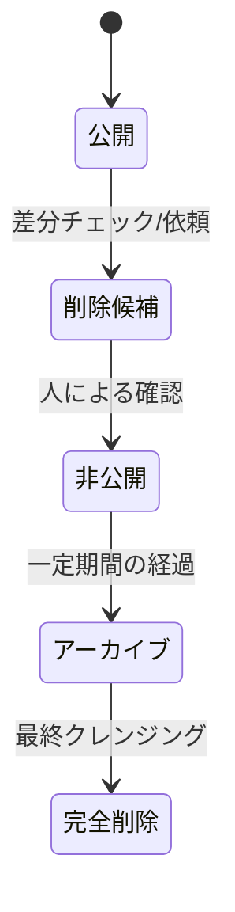

# データ更新ポリシーと運用ガイド (Data Update Policy)

介護事業所データ（[facilities.csv](file:///c:/Projects/care-portal_v2/data/facilities.csv)）の追加・修正・削除プロセス、およびオープンデータ等の元データとの差分を安全にチェックし反映させる運用指針について説明します。

---

## 1. 介護事業所データの分類と更新頻度

マスタデータは以下の3つのトリガーで変動します。

1. **追加 (Addition)**: 新規開業された事業所、または今まで掲載していなかった対象自治体の事業所。
2. **修正 (Modification)**: 名称変更、移転による住所変更、電話番号変更、または運営会社（親法人）の変更など。
3. **削除・非公開化 (Deletion/Unpublish)**: 廃業・休止した事業所、あるいは事業所側から掲載取り下げの依頼があった場合。

自治体が公開するオープンデータ等は一般に **「数ヶ月〜半年に1回」** などの頻度で更新されます。これに合わせて定期的に差分チェックを行います。

---

## 2. 差分チェックの方法（将来的な方針）

手動での全件目視はミスの原因となるため、将来的にはスクリプト（Node.js / Python等）による**自動差分検出（Diff）**を導入します。

* **照合のキー**: 介護サービス事業所ごとに国から割り当てられる一意の **「事業所番号 (officeNumber, 10桁)」** をプライマリキーとして照合します。

### 差分検出の定義

元データ（自治体等の最新CSV）と現データ（`facilities.csv`）を事業所番号で突合した結果：

* **追加候補**: 元データに存在し、現データに存在しない「事業所番号」のレコード。
* **修正候補**: 同一の「事業所番号」で、住所、電話番号、事業所名などの値に不一致があるレコード。
* **削除候補**: 現データに存在するが、元データから消えている「事業所番号」のレコード。

---

## 3. 段階的なデータ削除プロセス（自動削除の禁止）

本ポータル運用の安全性を担保するため、**「元データから消えたレコードを、システムが自動的にCSVから即座に削除・非公開化しない」** という方針を徹底します。

削除が必要なデータは、必ず以下の **5つのステージ** を経て段階的に処理してください。

### ステージ 1: 公開 (Published)
* **状態**: CSVの `isPublished` 列の値が `true`。
* **挙動**: サイト上に表示され、検索可能であり、詳細ページも生成されています。

### ステージ 2: 削除候補 (Delete Candidate)
* **状態**: 元データから存在が確認できなくなった、または閉鎖申請があったデータ。
* **挙動**: データ自体は「公開」のままですが、管理用リスト等に「削除候補」として記録され、オペレーターがステータス（実在しているか、休止か）を調査・確認する対象となります。

### ステージ 3: 非公開 (Unpublished)
* **状態**: CSVの `isPublished` 列の値を `false` に書き換えます。
* **挙動**: サイトの検索結果から即座に除外され、詳細ページも生成（ビルド）されなくなります。これにより一般ユーザーへの誤情報の提示を防ぎます。

### ステージ 4: アーカイブ (Archived)
* **状態**: 非公開化してから一定期間（例：3ヶ月〜6ヶ月）が経過し、復活の見込みがないデータ。
* **挙動**: メインの [facilities.csv](file:///c:/Projects/care-portal_v2/data/facilities.csv) から行を取り除き、履歴保存用の別ファイル（例：`data/facilities_archive.csv`）にレコードを移動させます。これによりメインデータの軽量化を図ります。

### ステージ 5: 完全削除 (Complete Deletion)
* **状態**: アーカイブされてから長期間経過し、かつ問い合わせやトラブル等の懸念が一切なくなったデータ。
* **挙動**: アーカイブファイルおよびマスタ上のレコードを完全に消去します（過去の履歴はGitのコミット履歴上には永久に保存されます）。
