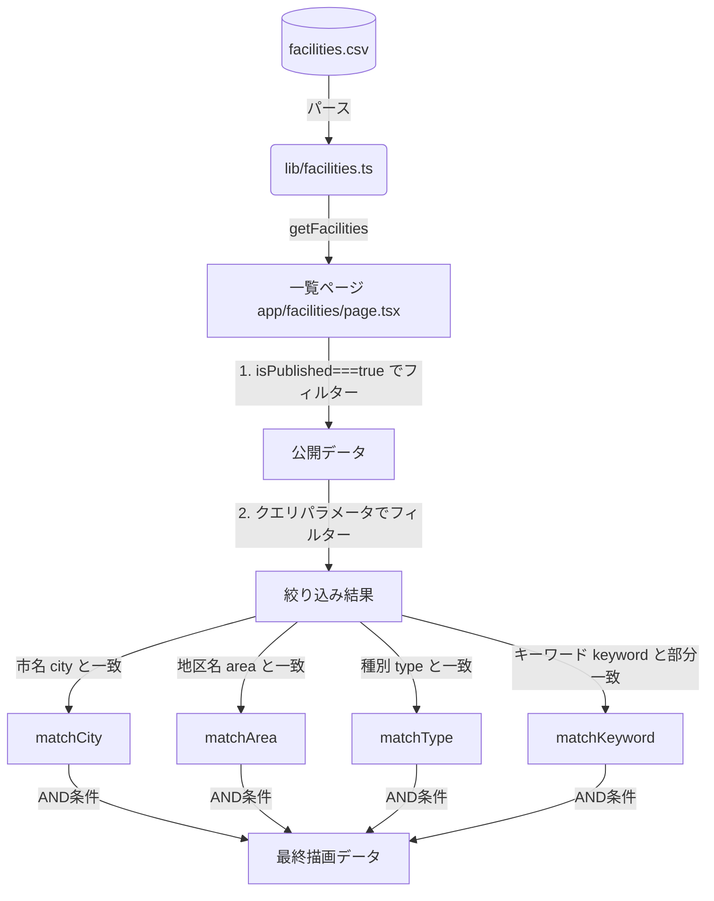

# 機能説明: 介護事業所検索 (Feature: Facilities Search)

ユーザーが目的の介護事業所を、サービス種別やエリア、キーワード等から絞り込み、詳細情報を確認するための機能です。

---

## 1. 目的

地域住民やケアマネジャーが、本人に合った最適な介護サービス事業所（訪問介護、通所介護など）を迅速に見つけられるようにすることを目的としています。直観的で迷わない操作性と、即座に検索結果が表示される高速性を重視します。

---

## 2. 仕様と要件

本機能は、以下の3つの主要画面とそれぞれの制御ロジックから構成されます。

### 2.1. トップページのエントリーナビゲーション (`/`)
* **仕様**:
  * ポータルに登録されている全公開事業所から、市区町村（`city`）リストを動的に抽出してボタン表示します。
  * ボタンをクリックすると、特定の市に絞り込んだ状態で一覧ページへ遷移します（例：`/facilities?city=春日市`）。
  * 地区名ではなく、市単位に統一することで、画面上の情報量を適切に保ちます。

### 2.2. 一覧検索ページ (`/facilities`)
* **仕様**:
  * クエリパラメータ（`city`, `area`, `type`, `keyword`）の組み合わせによるリアルタイムな条件検索を行います。
  * **段階的なエリア絞り込み**:
    * 市区町村（`city`）が未選択（「すべて」）の状態では、詳細エリア（`area`）の選択肢を表示しません。
    * 市区町村が選択されたタイミングで、その市に属する詳細エリアのリストを重複排除して抽出し、動的に表示します。
  * **表示の最適化**:
    * エリア表示（および事業所カード上のエリア表記）からは、親の市名を自動で除去して表示します（例：`春日市小倉` ➡ `小倉`）。

### 2.3. 詳細ページ (`/facilities/[slug]`)
* **仕様**:
  * 各事業所の基本情報（事業所番号、運営法人、サービス種別、所在地、電話番号、営業時間、対応エリア）を一覧表示します。
  * 住所から自動的にGoogleマップの検索URLを生成してリンクを提供します。
  * **同一エリアの事業所提案**:
    * 表示中事業所と同じ詳細エリア（`area`）に属する他の公開事業所を最大3件まで「同じエリアの事業所」として提案し、回遊性を向上させます。

---

## 3. データの流れ (Data Flow)

本検索機能におけるデータの取得・加工・フィルタリングの流れです。

---

## 4. 関連ファイル

* [data/facilities.csv](file:///c:/Projects/care-portal_v2/data/facilities.csv): 事業所データソース。
* [lib/facilities.ts](file:///c:/Projects/care-portal_v2/lib/facilities.ts): CSV読み込みおよびパースロジック。
* [app/page.tsx](file:///c:/Projects/care-portal_v2/app/page.tsx): トップページ（市リスト生成、最新の3件新着表示）。
* [app/facilities/page.tsx](file:///c:/Projects/care-portal_v2/app/facilities/page.tsx): 一覧・検索ロジックおよびフィルターUI。
* [app/facilities/[slug]/page.tsx](file:///c:/Projects/care-portal_v2/app/facilities/[slug]/page.tsx): 詳細ページおよび同一エリア事業所の抽出。

---

## 5. 今後の拡張ポイント

1. **件数増加時のページネーション / 無限スクロール**:
   現在、一覧ページのフィルタリング処理はクライアントサイドで全件（約1,500件）に対して一括実行しています。今後、掲載事業所数が数万件以上に増えた場合は初期表示速度が低下するため、サーバーサイド（API）でのフィルタリングおよびページネーションの導入が必要です。
2. **位置情報を利用した地図上検索**:
   各事業所データには緯度（`latitude`）や経度（`longitude`）の項目はありますが、現在は使われていません。これらを用いて、Google Maps APIやMapbox等を統合し、「現在地から近い順」での地図検索機能を実装することが想定されます。
